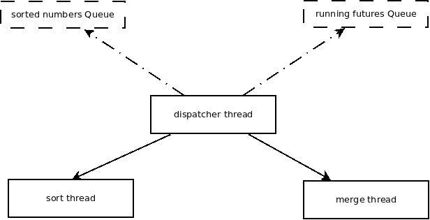

## 问题描述
1.给定n个无序数组，设计一个多线程sort merge方案。

## 问题分析
merge
sort原理是，每次将有序的元素merge，增加有序元素的长度，直至所有元素都有序，因此方案分为两个步骤：
1. 将每个无序数组排序
2. 将n个有序数组merge

## 方案设计
将本问题抽象为“生产者-消费者”问题，每个sort_merge线程为声场者，生产有序数组，每个merge线程是消费者，将2个有序数组合并，同时merge线程也是生产者，因为会产出合并后的有序数组。
如下图所示：

本方案包括一个调度线程（dispatcher
thread），负责调度merge线程和sort线程的运行，sort线程负责将一个无序数组排序，merge线程负责将两个有序数组合并为一个有序数组，sorted
numbers Queue中储存着已经排好序的数组，队列中每个元素是一个有序数组，running futures
List中保存正在运行的sort线程和merge线程的future，用于获取返回值。
在运行时，调度线程采用轮询（Round-robin）的方法，遍历running futures
list，将ready的future删除，取回该线程的运行结果，放入sorted numbers
queue中，同时调度线程还负责检查sorted number queue的size，每当sorted numebrs
queue中保存的有序数组个数多于2时，将队首2个有序数组出队，创建一个merge线程，合并这两个有序数组。调度线程循环这个过程，直至running
futurtes list中没有元素并且sorted numbers
queue的size为1时即没有sort线程和merge线程正在运行，并且只剩下一个有序数组时，排序完成,返回结果。

## 方案自我评价
### 优点
1. 由于每个sort线程和merge线程访问的数据不共享，并且每次生成新数据，保证传入的数据不变，因此可以不用加锁解决同步问题；
2. 每当有2个有序数组时，就执行merge线程，充分利用系统资源；
3. 采用双向链表实现running futures list，保证插入、删除的效率。

### 缺点
1. 为了保证保证数据相互独立，大量采用传值的方式，因此耗费内存，并有一定性能损耗；
2. 为了简单实现，调度算法比较简单，可以改进调度方式，优先查询merge短数组的future结果；
3. 可以考虑用堆作为缓冲，每次从堆中取出最短的两个有序数组进行merge，但实现比较复杂。

## 进一步考虑
以上方案基于内存充分的基础，当内存受到限制时，可能需要作出以下改进：
1. 建立一个线程池，每次只执行一定数量的线程，牺牲一定的并发性，保证资源使用
2. 开启swap，利用虚存
2. 使用文件存储一定数据量的有序数组，每次merge一个文件大小，最后将小文将merge成一个大文件。

## 实验环境说明
| key | value |
|---|------|
| OS | macOS el caption|
| compiler | Apple llvm version 8.0.0|
| c++ std | c++11 |
| gxx-include-dir| c++/4.2.1 |
